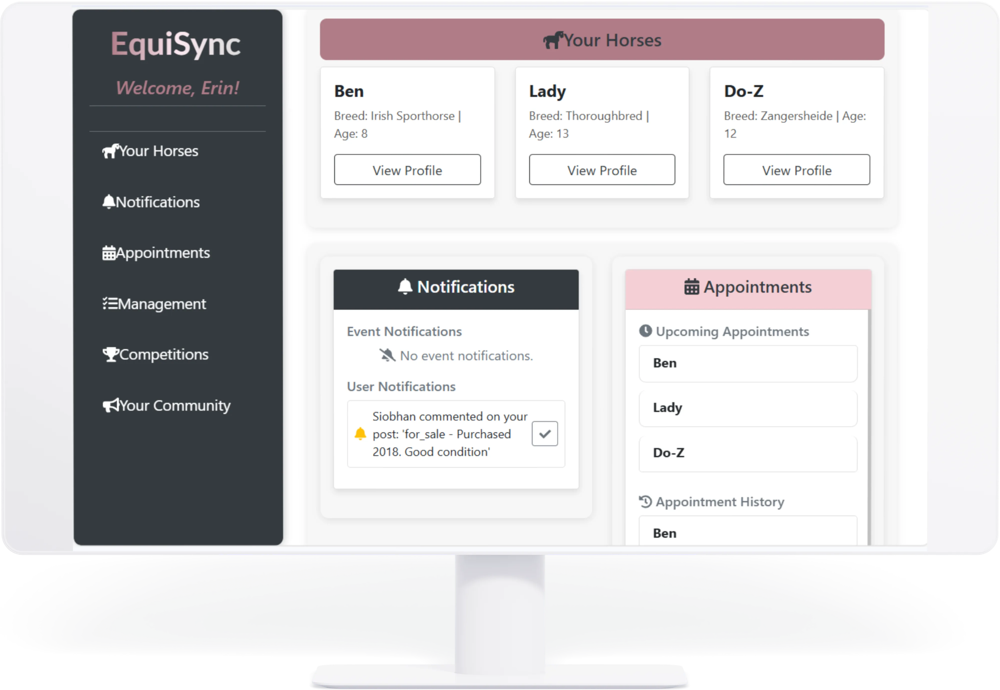
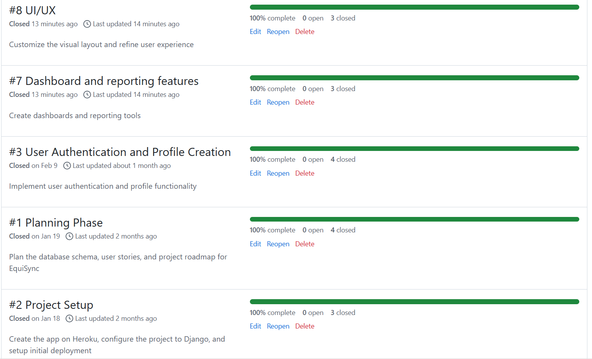
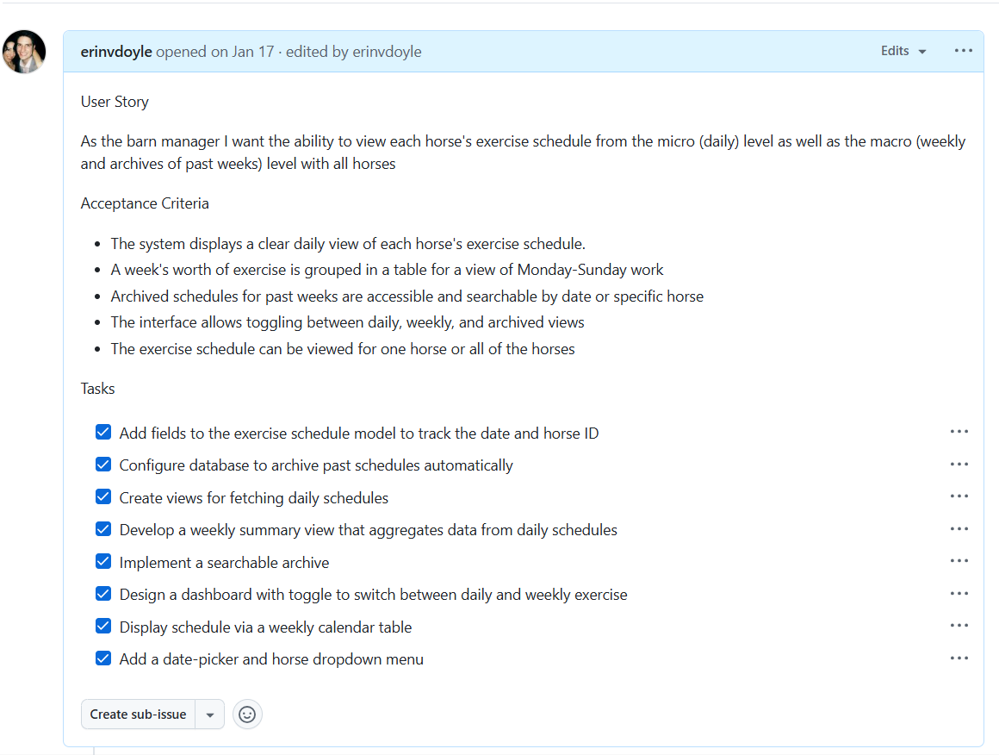
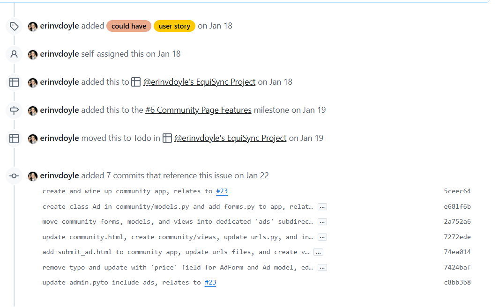
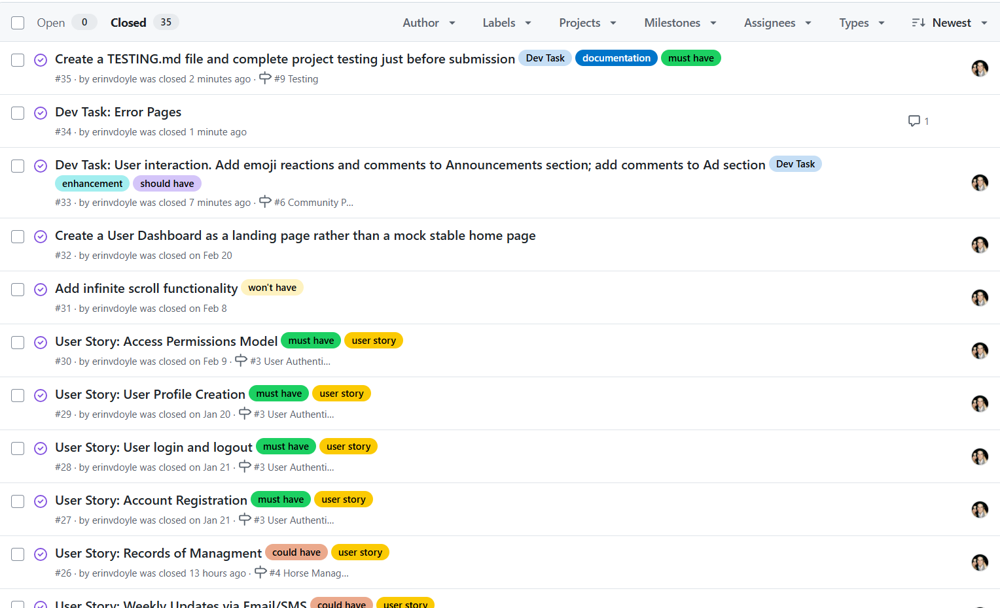
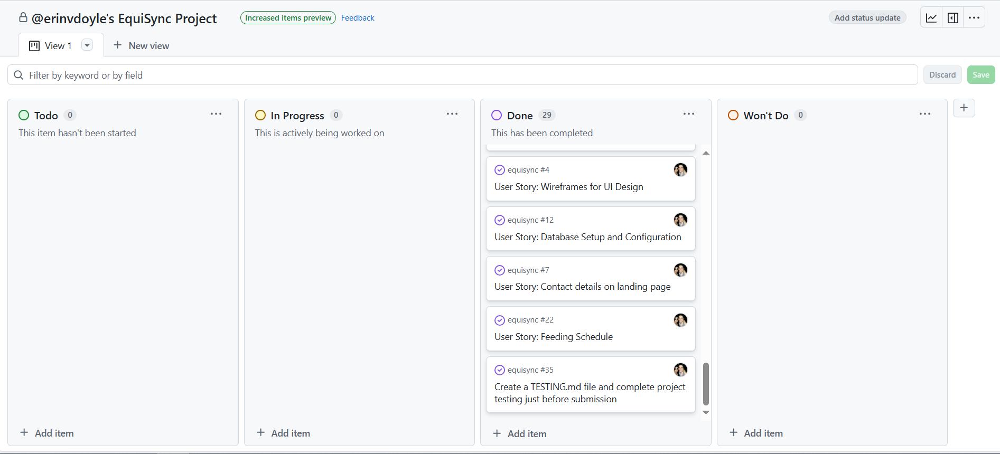

# EquiSync



[Link to deployed site](https://equisync-d4a4079b524b.herokuapp.com/)
<hr>
EquiSync is a full-stack web platform designed to help equestrian facilities manage horse care, communication, and scheduling — all in one place. Built with Django, it supports horse profiles, feeding and exercise plans, appointments, competition tracking, a mini online marketplace and announcement board, and user roles (owners, barn managers, and staff). With notifications, responsive design, and admin tools, EquiSync streamlines stable operations and keeps every member of the team connected

## Features Preview
EquiSync provides streamlined tools for managing an equestrian facility, ensuring the right people have access to the right information — along with real-time notifications, responsive design, and an intuitive interface

### Key Features
- Horse profile creation & approval workflow
- User dashboard with centralized information
- Feeding chart planner with staff alerts
- Exercise & appointment scheduling and time tracking
- Competition management
- Custom notification system
- Role-based permissions
- Mobile-friendly UI

# Table Of Contents

-   [User Experience](#user-experience)
    -   [User Stories](#user-stories)
    -   [Project Goal](#project-goal)
    -   [Scope](#scope)
-   [Agile Methodology](#Agile-Methodology)
    -   [Overview](#overview)
    -   [EPICS(Milestones)](#epicsmilestones)
    -   [User Stories issues](#user-stories-issues)
    -   [MoSCoW prioritization](#moscow-prioritization)
    -   [GitHub Projects](#github-projects)
-   [Design](#design)
    -   [Database Schema](#Database-Schema)
    -   [Wireframes](#Wireframes)
    -   [Colour Scheme](#colour-scheme)
    -   [Typography](#Typography)
-   [Features](#features)
-   [Future Features](#future-features)
-   [Testing](#testing)
-   [Bugs](#Bugs)
-   [Technologies And Languages](#technologies-and-languages)
-   [Deployment](#deployment)
-   [Credits](#credits)
-   [Contact](#contact)


## User Experience

### User Stories

<details>
  <summary>Developer Stories (click)</summary>
  
  - **As a developer:**  
    1. I want to organize my project with milestones and a Kanban board of issues, so that I can track progress and maintain a structured workflow.  
    2. I want to create user stories for different user roles, so that the project requirements are clear and development aligns with user needs.  
    3. I want to design a database schema for my project, so that the data structure supports the application’s functionality and scalability.  
    4. I want to create wireframes for the application, so that the user interface is intuitive and consistent across all devices.  
    5. I want to create a README file with thorough documentation, so that other developers and users can understand the purpose, features, and usage of the application.  
    6. I want to set up a Django project so that the application has a structured foundation for development.  
    7. I want to create and configure a database so that user data is properly stored.  
    8. I want to deploy the app early and often to verify a successful setup and ensure testing throughout development.  

</details>

<details>
  <summary>Site User Stories (click)</summary>
  
  - **As a site user:**  
    1. I want to register an account so that I can access all of the user-only functionality of EquiSync
    2. I want to log in and log out of my account so that I can access or secure my personal information and user-only functionality of EquiSync
    3. I want to have a profile created after registration so that I can manage role-specific information and settings

</details>
<details>
  <summary>Visitor Stories (click)</summary>
  
  - **As a visitor:**  
    1. I want to to learn about the stable, its owner, and its horses
    2. I want to be able to contact the manager with a simple contact form and offline details as well
    3. I want to view the calendar of upcoming horseshows the stable will attend
    4. I want to be able to view the stable's previously attended events and search for events by name or date
    5. I want to view the stable community page of announcements and sales ads
    6. I want a responsive site design that functions across all of my devices 

</details>
<details>
  <summary>Barn Manager Stories (click)</summary>
  
  - **As the Barn Manager/Admin:**  
    1. I want an admin dashboard that allows me to view, edit, and approve all owner, rider, and staff updates to their horses' data
    2. I want to have full access to all functionality of EquiSync, while horse owners, staff, and riders should only access features relevant to their roles
    3. I want a simple data collection system that enambles me to collate each horse's feed, exercise, appointment, and show schedules
    4. I want the ability to view each horse's exercise schedule from the micro (daily) level as well as the macro (weekly and archives of past weeks) level
    5. I want the ability to quickly and conveniently share a horse's data with its owner or other care personnel via email or text
    6. I want the right of approval over all community page posts
    7. I want each horse to have a stored profile so that I have easy access to its relevant details (age, breeding, owner, vet, etc)
    8. I want a show schedule for all horses and each individual horse
    9. I want a show schedule that displays show details and can be viewed in calendar form by both myself, and my staff and clients
    10. I want the management of each horse's daily exercise and appointment schedule to be easily updated, viewed, and shared by myself and my staff and clients
    11. I want to be able to see the daily management of all horses displayed together for the entire week
    12. I want all aspects of each horse's feeding schedule to be stored and easily viewed by myself and all staff and clients
    13. I want to be able to update the horse feeding schedule as needed and view the feeding requirements for all horses displayed together and grouped by the day's time and type of feed

</details>
<details>
  <summary>Horse Owner Stories (click)</summary>
  
  - **As an owner:**  
    1. I want a community page where I can view listings and announcements and create and edit my own
    2. I want to see my horse's routines and schedules diaplayed with a simple, intuitive layout
    3. I want to be able to receive a weekly or daily update on my horse's exercise and appointment schedule via email or sms
    4. I want a weekly and monthly calendar view of my horse's upcoming competitions

</details>

<details>
  <summary>Rider Stories (click)</summary>
  
  - **As a rider:**  
    1. I want to be be able to view previous exercise routines and performance trends and track future exercise and competition schedules of the horses I ride to help me stay consistent and achieve my goals
    2. I want to engage with clients, staff, and owners on the community page and buy/sell riding equipment

</details>
<details>
  <summary>Staff Member Stories (click)</summary>
  
  - **As a staff member:** 
    1. I want thorough and efficient storage of horse schedules and routines so that all fellow staff, riders, and owners know what is going on with each horse, thus avoiding surprise events and missed appointments
    2. I want a record of my management of the horses I work with so that owners know their horses are receiving great care
    3. I want to engage with clients, staff, and owners on the community page and buy/sell riding equipment 

</details>

### Project Goal

The primary goals of EquiSync:

1. Streamline Stable Operations
2. Enhance Communication
3. Empower Horse Owners
4. Enable Data-Driven Decisions
5. Foster Community Engagement
6. Most Importantly, Prioritize Horse Welfare and Performance

### Scope
EquiSync is a horse stable management system designed to streamline communication and daily operations for barn managers, staff, riders, and horse owners. This application integrates key functionalities like scheduling, horse profile management, feeding guidelines, and a community page for announcements, events, and sales. 

The scope of this project includes:

1. User Management
  - Support for multiple user roles: Barn Manager (Admin), owners, riders, and staff
  - Role-based permissions for access across the platform
2. Horse Management
  - Detailed profiles for each horse, including age, breed, owner, vet, and relevant health or management notes
  - The ability to view and manage individual and group schedules for feeding, exercise, and appointments
3. Show and Event Scheduling
  - Weekly and monthly calendar views for all upcoming horse shows
  - Shows schedules can be updated in real-time by barn managers and approved staff 
4. The Community Page
  - A centralized space for announcements, events, and sales ads
  - Users enabled to post, edit, and delete content (with Admin approval for published posts)
5. Scalability and Ease of Use
  - An application which accomodates stables of varying sizes
  - An intuitive and accessible interface that performs across multiple devices

#### Features

#### Benefits


## Agile Methodology

### Agile Development Approach

#### Overview  
This project followed agile principles throughout the development process. As my first full-stack build, there were a lot of moving parts, and the agile framework helped break everything down into manageable steps. Planning features around user stories with clear acceptance criteria and task lists gave the project structure and ensured each feature had a clear purpose and outcome. I spent the first week establishing my wireframes, user stories, and Kanban board, which was very much not my usual workflow and initially felt counterintuitive, but in the end, I think it paid off

#### Epics & Milestones  
User stories were grouped into nine key milestones (or "epics"), each representing a major feature or theme of the project
<br>


#### User Story Structure  
Each issue was framed as a user story, complete with its acceptance criteria and task list to break the work into smaller chunks  
<br>
  
Whenever possible, commits were linked to their corresponding user stories for clear traceability 
<br>


#### ✅ MoSCoW Prioritization  
To keep development focused and efficient, the MoSCoW method was used to prioritize features. This technique sorts requirements into four buckets:  
**Must have**, **Should have**, **Could have**, and **Won’t have** helping ensure the most essential functionality made it into the final product  
<br>


####  GitHub Projects  
A simple Kanban-style board was used via GitHub Projects to track progress. Tasks moved through stages like **To Do**, **In Progress**, and **Done**— keeping the workflow organized and easy to manage at a glance 
<br>



## Design

### Database Schema
The original Entity Relationship Diagram for EquiSync was created with Lucid Charts

<details>
  <summary>Equisync ERD (click)</summary>
   
  

</details>

I created the ERD above as I planned my project. But by virtue of this being a passion project, and one which I would like to use to help record my own horses' management, my project quickly outgrew the first schema.

I used Graphviz to generate the final ERD, which I will discuss in the Models section, just below this one

<details>
  <summary>Final Equisync ERD (click)</summary>
   
  

</details>

#### Models

##### ERD Model Overview (EquiSync)

A summary of each model in the project and how they relate to each other, as visualized in the Entity Relationship Diagram (ERD).

---

######  Core User & Authentication Models

- **User (`auth_user`)**  
  Django's default user model. Most models like `Ad`, `Announcement`, `HorseProfile`, etc., link to a user to indicate ownership.

- **Group / Permission / User_Groups / User_Permissions**  
  Built-in Django auth tables used for managing roles, permissions, and group memberships.

---

##### Horse & Care Models

- **HorseProfile**  
  Core to the system. Represents an individual horse with fields like name, age, breed, etc. Linked to `FeedingChart`, `ExerciseSchedule`, `Appointment`, `EventHorse`, and others.

- **FeedingChart**  
  Stores structured feeding routines for each `HorseProfile`, including meals, supplements, and medications.

- **ExerciseSchedule**  
  Linked to a horse, this defines their overall weekly training schedule. Related to `ExerciseScheduleItem`.

- **ExerciseScheduleItem**  
  Defines daily exercises under an `ExerciseSchedule`, including type and duration.

- **Appointment**  
  Tracks medical and care appointments for a horse (e.g. vet, farrier).

---

##### Competition & Event Models

- **Event**  
  Represents a competition, show, or clinic. Connects to participating horses via `EventHorse`.

- **EventHorse**  
  Intermediate model between `Event` and `HorseProfile`. Stores attendance and results.

---

##### Community & Social Models

- **Ad**  
  For sale/wanted ads linked to a user. Comments and contact info may be attached.

- **Announcement**  
  General posts or notices shared with the stable. Includes description, optional image, and reactions.

- **Comment**  
  Uses Django's `ContentType` framework to support commenting on different models (e.g. `Ad`, `Announcement`).

- **Reaction**  
  Emoji-based reactions linked to a specific `Announcement` and user.

- **CommunityEvent**  
  Informal, social, or stable-wide events (e.g., tack sales, BBQs).

---

##### Notifications & Logs

- **Notification**  
  Alerts linked to a user and optionally a horse or event. Tracks new comments, events, etc.

---

##### Other Utility Models

- **Profile**  
  Extends the default User model. Contains extra data such as role, avatar, etc.

- **SavedAd**  
  Join model allowing users to favorite or save ads for later.

---

##### Relationships Summary

- **User → Many**: `HorseProfile`, `Ad`, `Announcement`, `CommunityEvent`, `Comment`, `Notification`
- **HorseProfile → Many**: `FeedingChart`, `ExerciseSchedule`, `Appointment`, `EventHorse`, `Notification`
- **Ad / Announcement**: Support multiple `Comment` and `Reaction`
- **Event → Many**: `EventHorse`
- **ExerciseSchedule → Many**: `ExerciseScheduleItem`
- **Announcement → Many**: `Reaction`

<details>
  <summary>Planning Stage Discussion of Models</summary>
1. User  
The primary account management and authentication system. Contains login information (username, password, email) and connects to the Profile for additional details  

2. Profile  
Extends the User model to store additional personal and role-specific details such as role (owner, rider, staff), associated horses, and contact information

3. AccessPermissions  
Defines the specific permissions or roles for users (admin, read-only, edit)  

4. Events  
Represents community page events organized by users, such as barn gatherings, dinners, or parties. Includes details like date, location, and an event description  

5. Announcements  
Allows users to post updates or important notices for the community  

6. SalesAds  
Advertisements created by users to buy, sell, or trade items related to horse care and riding  

7. Horse  
A detailed profile for each horse, including attributes like name, age, breed, owner, and photo. Serves as the central model connecting to feed, exercise, appointments, and show schedules  

8. Feed  
The feeding schedule for a horse, detailing types of feed, amounts, supplements and medications, and times of feeding  

9. Appointments  
Tracks appointments for a horse, such as vet visits, farrier sessions, or other scheduled activities  

10. Exercise  
Stores the exercise schedule for a horse  

11. ShowSchedule  
Represents the show and competition schedule for a horse, including dates, event locations, and details about participation
</details>

#### Relationships

1. User-to-AccessPermissions  
**One-to-One**: Each user has a single set of access permissions  

2. User-to-Profile  
**One-to-One**: Each user has one profile containing additional details  

3. Profile-to-Events  
**One-to-Many**: One profile can post multiple events, but an event belongs only to one profile  

4. Profile-to-Announcements  
**One-to-Many**: One profile can create multiple announcements, but an announcement belongs to only one profile  

5. Profile-to-SalesAds  
**One-to-Many**: One profile can advertize multiple sales ads, but each ad belongs to only one profile  

6. Profile-to-Horse  
**Many-to-Many**: A profile can be associated with multiple horses (a horse owner may own multiple horses) and each horse can be associated with multiple profiles (for example, owner *and* staff)  

7. Horse-to-Feed  
**One-to-One**: Each horse has a single feeding schedule. Modifications to the feeding schedule occur infrequently and archives are not stored  

8. Horse-to-Appointments  
**One-to-Many**: Each horse has one unique appointments schedule at any given time, but archives are stored so that there are many schedules on record  

9. Horse-to-Exercise  
**One-to-Many**: Each horse has one unique exercise schedule at any given time, but archives are stored so that there are many schedules on record  

10. Horse-to-ShowSchedule  
**One-to-Many**: Each horse has one unique show schedule at any given time, but archives are stored so that there are many schedules on record  

### Wireframes
The UI for this project was planned with Balsamiq Wireframes

<details>
  <summary>Login, Dashboard, and Profiles (click)</summary>
  
  - **Login**  
    
  - **Admin**  
    
  - **User**  
    
  - **Horse Profile**  
    
  
</details>

<details>
  <summary>Show Schedule Calendar (click)</summary>
  
  - **Show Schedule**  
    
  - **Individual Horse Show Schedule**  
    
  
</details>

<details>
  <summary>Horse Management (click)</summary>
  
  - **Stable Management**  
    
  - **Individual Management**  
    

</details>

<details>
  <summary>Feeding Guidelines (click)</summary>
  
  - **Stable Feeding Guidelines**  
    
  - **Individual Feeding Guidelines**  
    

</details>

### Color Scheme

EquiSync uses a clean, modern visual identity designed to feel calm, professional, and accessible for a wide range of users in the equestrian space.

I employed a color palette with a soft, muted scheme inspired by natural tones and stable life, with rose-tinted accents to create warmth and hierarchy

| Purpose              | Color Name        | Hex Code    | Preview |
|----------------------|-------------------|-------------|---------|
| Primary Accent       | Rose Pink         | `#EFBCCF` |  |
| Secondary Highlight  | Blush Coral       | `#FADADD` |  |
| Neutral Background   | Light Cream       | `#FFF8F2` |  |
| Text Color           | Charcoal Gray     | `#333333` |  |
| Soft Divider/Shadow  | Dusty Taupe       | `#D7C6BF` |  |


### Typography

EquiSync uses the **[Lato](https://fonts.google.com/specimen/Lato)** font for all primary headings. This friendly, open sans-serif typeface provides excellent readability across all screen sizes

```css
font-family: 'Lato', sans-serif;
```

**Example:**

> ### Welcome to EquiSync

## Use of AI

### Troubleshooting, errors, and bugs

### Events Calendar Section

## Future Features

## Testing

Please see my testing documentation [here.](./TESTING.md)

## Bugs

## Languages & Technology

### Languages
- HTML
- CSS
- JavaScript
- Bootstrap
- Python
- Django

### Python Modules

| Package | Description |
|---------|-------------|
| **certifi** | Up-to-date root certificates for secure HTTP requests. |
| **charset-normalizer** | Detects character encodings for text data. |
| **cloudinary** | Upload/manage images via Cloudinary API. |
| **colorama** | Adds colored output support in the terminal. |
| **dj-database-url** | Configures Django DB using a URL (Heroku-friendly). |
| **Django** | Full-stack Python web framework. |
| **django-allauth** | Integrated authentication system (email/social login). |
| **django-cloudinary-storage** | Media file storage via Cloudinary. |
| **django-dbbackup** | Back up and restore Django DB/media. |
| **django-filter** | Filtering support for Django views or DRF. |
| **django-scheduler** | Calendar-based event scheduling for Django. |
| **django-storages** | Pluggable storage backends for Django. |
| **django-tables2** | HTML tables from Django models with features. |
| **django-timezone-field** | Time zone field support in Django models. |
| **gunicorn** | WSGI HTTP server for production Django apps. | |
| **oauthlib** | OAuth 1/2 authentication framework. |
| **pillow** | Image processing in Python (PIL fork). |
| **platformdirs** | Determines paths for config/cache/data storage. |
| **psycopg2-binary** | PostgreSQL database adapter for Python. |
| **PyJWT** | JSON Web Token auth encoding/decoding. |
| **python3-openid** | OpenID authentication library. |
| **pytz** | World timezone support for datetime objects. |
| **requests** | Simple, elegant HTTP library. |
| **requests-oauthlib** | OAuth support for requests. |
| **tzdata** | IANA timezone database. |
| **whitenoise** | Serve static files efficiently in Django |

## Deployment

###  Before Deployment

Before deploying to Heroku, you’ll want to update your `requirements.txt` file — this ensures Heroku knows which dependencies to install.

To generate or update it, run:

```bash
pip3 freeze > requirements.txt
```

Once updated, commit and push your changes to GitHub.

> 🔐 **Important:** Make sure any sensitive credentials (like API keys or passwords) are stored in an `env.py` or `.env` file. Add this file to `.gitignore` so it doesn’t get pushed to GitHub and exposed publicly.

---

###  Deploying to Heroku

1. [Create a Heroku account](https://heroku.com) if you don’t already have one.
2. Once logged in, click **Create new app**.
3. Give your app a unique name, select your region, and click **Create App**.

#### Config Vars (Environment Variables)

In the Heroku app dashboard:

- Navigate to **Settings** → **Reveal Config Vars**.
- Add any environment variables your project needs, such as:

```
DJANGO_SECRET_KEY=your-secret-key
DATABASE_URL=your-database-url
AWS_ACCESS_KEY_ID=your-aws-key
AWS_SECRET_ACCESS_KEY=your-aws-secret
EMAIL_HOST_PASSWORD=your-email-password
```

####  Buildpacks

Scroll to **Buildpacks** and add:

- `Python` (for Django apps)

---

###  GitHub Integration & Deployment

1. Go to the **Deploy** tab.
2. Under **Deployment method**, choose **GitHub**.
3. Search for your repository name and click **Connect**.
4. Scroll down and optionally enable **Automatic Deploys**.
5. Finally, click **Deploy Branch**.

Once deployed, you’ll see a **“View App”** button to open your live site.

---

###  Forking This Repository

If you'd like to contribute or create your own version of the project:

1. Navigate to the original repository on GitHub.
2. Click the **Fork** button in the top-right.
3. Name your fork and optionally add a description.
4. Choose to copy the main branch or all branches.
5. Click **Create Fork**.

---

###  Cloning the Repository

To work locally:

1. On your fork, click the green **Code** button and copy the link.
2. In your terminal:

```bash
git clone https://github.com/your-username/your-fork-name.git
```

3. Navigate into the project folder and start building!

## Credits
[Extending the User Model](https://docs.djangoproject.com/en/5.1/topics/auth/customizing/#extending-user)  
[Creating User Profiles Automatically](https://www.codu.co/articles/easily-create-user-profiles-with-django-allauth-nsbnigtx)  
[Using hasattr()](https://hinty.io/ivictbor/create-user-profiles-in-django-if-they-does-not-exist/)  
[Using Signals](https://www.geeksforgeeks.org/how-to-create-and-use-signals-in-django/)  
[Adding model permission using Django Groups](https://stackoverflow.com/questions/8898724/django-admin-giving-staff-members-access-to-certain-areas-by-default/8900247)  
[Building an Online Marketplace](https://www.youtube.com/watch?v=ZxMB6Njs3ck)
[Django Models: Basics and Best Practices](https://dev.to/pragativerma18/django-models-basics-and-best-practices-49e4)
[Creating Custom Template Tags and Filters](https://django.readthedocs.io/en/stable/howto/custom-template-tags.html)
[Understanding and Implementing Custom Template Tags](https://dev.to/3bdelrahman/understanding-and-implementing-custom-template-tags-in-django-5cao)  
[Making Emojis Clickable](https://laracasts.com/discuss/channels/javascript/make-emojis-clickable-and-display-the-click-count?reply=932315)
[Displaying Number of Comments](https://stackoverflow.com/questions/35941445/how-to-display-number-of-comments-in-django)
[Implementing Reminder Functionality for Events](https://stackoverflow.com/questions/65561569/implement-reminder-functionality-for-events-in-python-django)
