# EquiSync
[Link to deployed site](https://)

Introduction to EquiSync project

# Table Of Contents

-   [User Experience](#user-experience)
    -   [User Stories](#user-stories)
    -   [Project Goal](#project-goal)
    -   [Scope](#scope)
-   [Agile Methodology](#Agile-Methodology)
    -   [Overview](#overview)
    -   [EPICS(Milestones)](#epicsmilestones)
    -   [User Stories issues](#user-stories-issues)
    -   [MoSCoW prioritization](#moscow-prioritization)
    -   [GitHub Projects](#github-projects)
-   [Design](#design)
    -   [Database Schema](#Database-Schema)
    -   [Wireframes](#Wireframes)
    -   [Colour Scheme](#colour-scheme)
    -   [Typography](#Typography)
-   [Features](#features)
-   [Future Features](#future-features)
-   [Testing](#testing)
-   [Bugs](#Bugs)
-   [Technologies And Languages](#technologies-and-languages)
-   [Deployment](#deployment)
-   [Credits](#credits)
-   [Contact](#contact)

## User Experience

### User Stories

1. As a developer, I want to organize my project with milestones and a Kanban board of issues, so that I can track progress and maintain a structured workflow
2. As a developer, I want to create user stories for different user roles, so that the project requirements are clear and development aligns with user needs
3. As a developer, I want to design a database schema for my project, so that the data structure supports the application’s functionality and scalability
4. As a developer, I want to create wireframes for the application, so that the user interface is intuitive and consistent across all devices
5. As a developer, I want to create a README file with thorough documentation, so that other developers and users can understand the purpose, features, and usage of the application
6. As a developer, I want to set up a Django project so that the application has a structured foundation for development
7. As a developer, I want to create and configure a database so that user data is properly stored
8. As a developer, I want to deploy the app early and often to verify a successful setup and ensure testing throughout development
9. As a site visitor, I want to to learn about the stable, its owner, and its horses
10. As a site visitor, I want to be able to contact the manager with a simple contact form and offline details as well
11. As a site visitor, I want to view the calendar of upcoming horseshows the stable will attend
12. As a site visitor, I want to be able to view the stable's previously attended events and search for events by name or date
13. As a site visitor, I want to view the stable community page of announcements and sales ads
14. As a site visitor, I want a responsive site design that functions across all of my devices
15. As the barn manager, I want an admin dashboard that allows me to view, edit, and approve all owner, rider, and staff updates to their horses' data
16. As the barn manager, I want a simple data collection system that enambles me to collate each horse's feed, exercise, appointment, and show schedules
17. As the barn manager, I want the ability to view each horse's exercise schedule from the micro (daily) level as well as the macro (weekly and archives of past weeks) level
18. As the barn manager, I want the ability to quickly and conveniently share a horse's data with its owner or other care personnel via email or text
19. As the barn manager, I want the right of approval over all community page posts
20. As the barn manager, I want each horse to have a stored profile so that I have easy access to its relevant details (age, breeding, owner, vet, etc)
21. As the barn manager, I want a show schedule for all horses and each individual horse
22. As the barn manager, I want a show schedule that displays show details and can be viewed in calendar form by both myself, and my staff and clients
23. As the barn manager, I want the management of each horse's daily exercise and appointment schedule to be easily updated, viewed, and shared by myself and my staff and clients
24. As the barn manager, I want to be able to see the daily management of all horses displayed together for the entire week
25. As the barn manager, I want all aspects of each horse's feeding schedule to be stored and easily viewed by myself and all staff and clients
26. As the barn manager, I want to be able to update the horse feeding schedule as needed and view the feeding requirements for all horses displayed together and grouped by the day's time and type of feed
27. As a horse owner, I want a community page where I can view listings and announcements and create and edit my own
28. As a horse owner, I want to see my horse's routines and schedules diaplayed with a simple, intuitive layout
29. As a horse owner, I want to be able to receive a weekly or daily update on my horse's exercise and appointment schedule via email or sms
30. As a horse owner, I want a weekly and monthly calendar view of my horse's upcoming competitions
31. As a rider, I want to be be able to view previous exercise routines and performance trends and track future exercise and competition schedules of the horses I ride to help me stay consistent and achieve my goals
32. As a rider, I want to engage with clients, staff, and owners on the community page and buy/sell riding equipment
33. As a staff member, I want thorough and efficient storage of horse schedules and routines so that all fellow staff, riders, and owners know what is going on with each horse, thus avoiding surprise events and missed appointments
34. As a staff member, I want a record of my management of the horses I work with so that owners know their horses are receiving great care
35. As a staff member, I want to engage with clients, staff, and owners on the community page and buy/sell riding equipment

### Project Goal

1. 
2. 
3. 
4. 

### Scope

#### Features

#### Benefits

## Agile Methodology

### Overview

### Epics

### User Story Issues

### MoSCoW

### GitHub Projects

## Design

### Database Schema
The Entity Relationship Diagram for EquiSync was created with Lucid Charts

  
Equisync ERD (click)

  
  - **Data Schema**  
    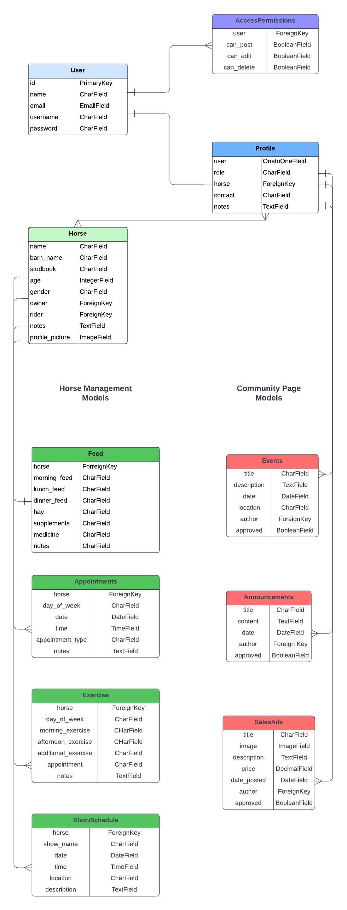

### Wireframes
The UI for this project was planned with Balsamiq Wireframes

  
Sunny Side Stable Website (click)

  
  - **Home**  
    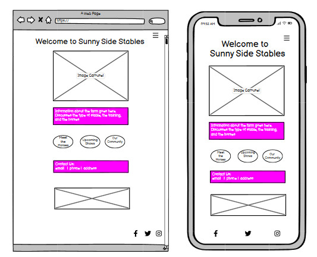
  - **Our Horses**  
    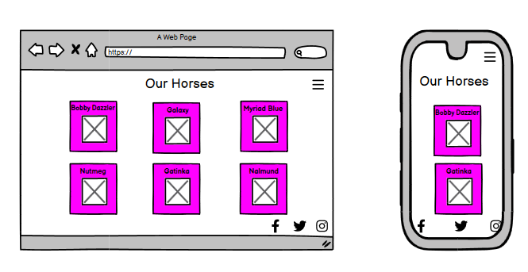
  - **Our Community**  
    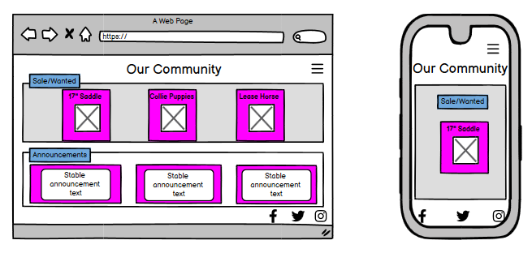
  - **Error 404**  
    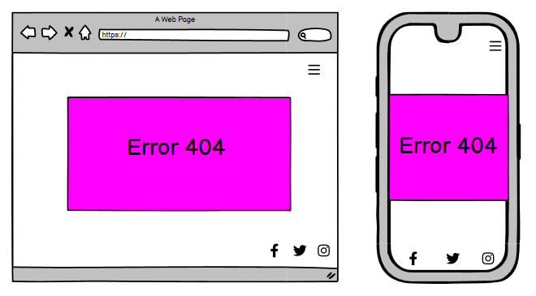

  
Login, Dashboard, and Profiles (click)

  
  - **Login**  
    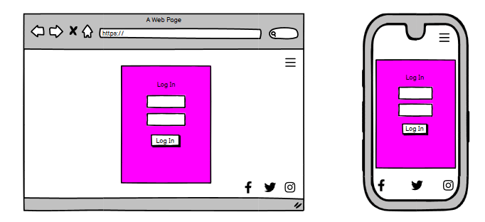
  - **Admin**  
    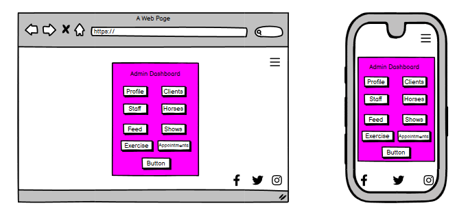
  - **User**  
    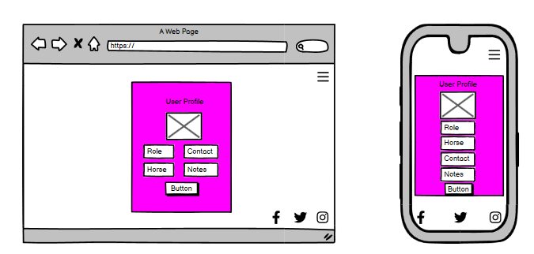
  - **Horse Profile**  
    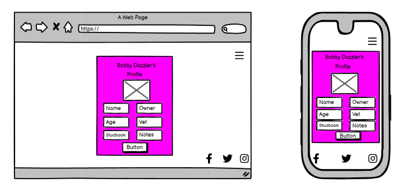
  

  
Show Schedule Calendar (click)

  
  - **Show Schedule**  
    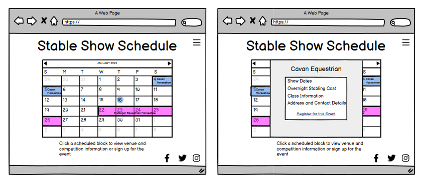
  - **Individual Horse Show Schedule**  
    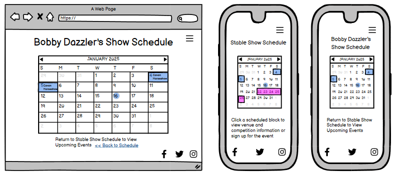
  

  
Horse Management (click)

  
  - **Stable Management**  
    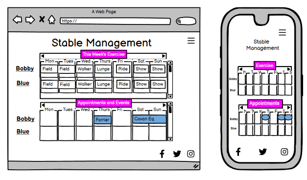
  - **Individual Management**  
    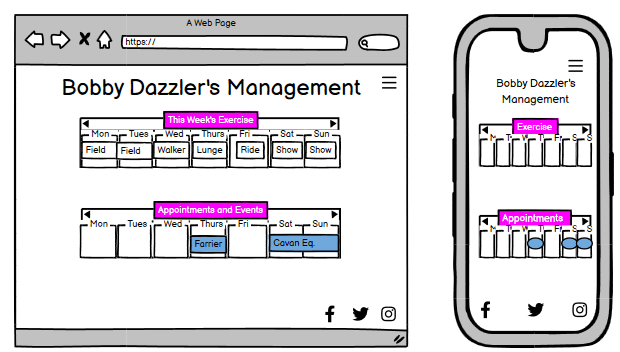

  
Feeding Guidelines (click)

  
  - **Stable Feeding Guidelines**  
    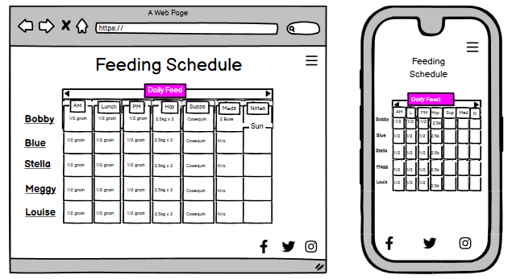
  - **Individual Feeding Guidelines**  
    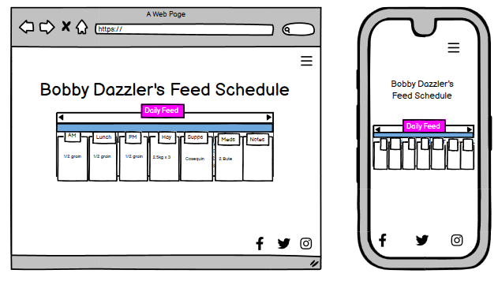

### Color Scheme

### Typography